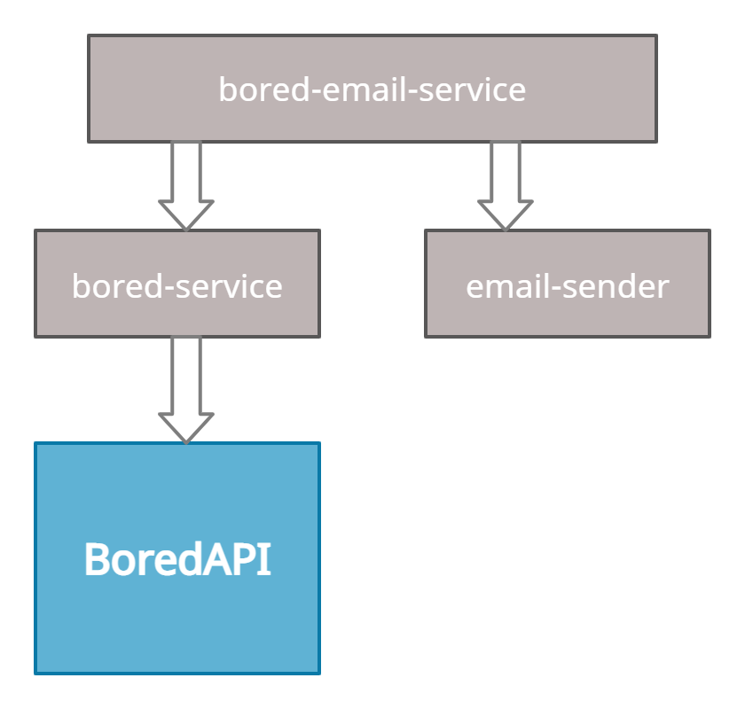
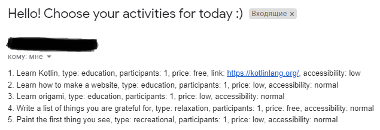

## Overview

### Application sends an email with 5 different activities every day at 9:00 AM 

- **bored-service** uses [**BoredAPI**](http://www.boredapi.com/) to get random activities
- **email-sender** sends an email by request
- **bored-email-service** is a main module. Collects activities from **bored-service** 
and then sends an email via **email-sender** service

### Result example

